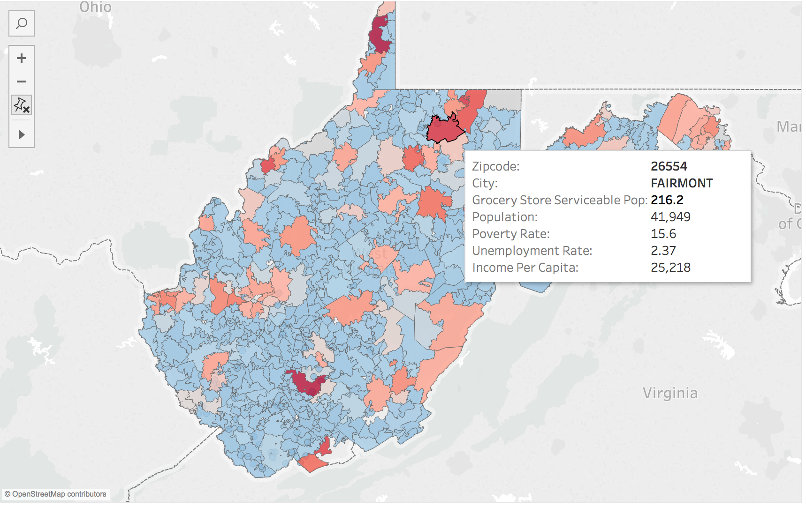

# Mapping-Access-Inequality
Mapping Access Inequality Project. Part of Workshop for Open Camps 2017. 

### Get Started by:
1. Cloning the Repository
2. Running the command `pip install requirements.txt`
3. Sign Up for An API Key from Google Maps: https://developers.google.com/places/web-service/
4. Register for an API Key from the US Census: https://api.census.gov/data/key_signup.html

---

### Relevant Links:

Life in a Banking Desert: https://www.theatlantic.com/business/archive/2016/03/banking-desert-ny-fed/473436/

Anaconda: https://www.anaconda.com/download/

Google API Key Registration: https://developers.google.com/places/web-service/

Tableau Public (Free) Download: https://public.tableau.com/en-us/s/download

Python Census Legend: https://gist.github.com/afhaque/60558290d6efd892351c4b64e5c01e9b
